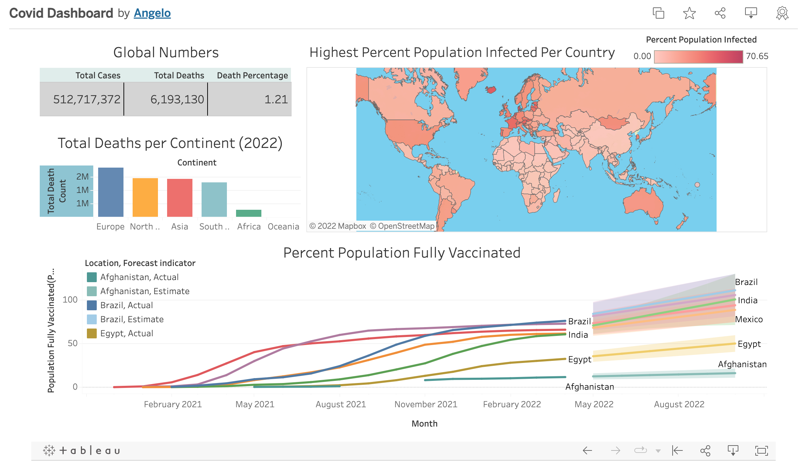

<h1 align = "center"> Covid 2022 Analysis </h1>

The data used in this project was retrieved on May 1, 2022.  
    The last record in the tables dates: April 30, 2022 

---

[Covid data exploration_queries](src/covid_dataexploration_queries.sql): Analyzes the large COVID 19 dataset using complex SQL queries.

[Tableau queries](src/tableau_covid_sql_queries.sql): Select queries that filters the large dataset to create a Tableau Covid Dashboard.

**Skills used:**
- SQL (PostgreSQL):
    - Joins
    -  CTE's
    -  Temp Tables
    -  Windows Functions(PARTITION, COALESCE,etc),
    -  Aggregate Functions,
    -  Creating Views
    -  Converting Data Types

- Python:
    - Pandas
    - Sql_Alchemy (Engine to interact with Database)

---

